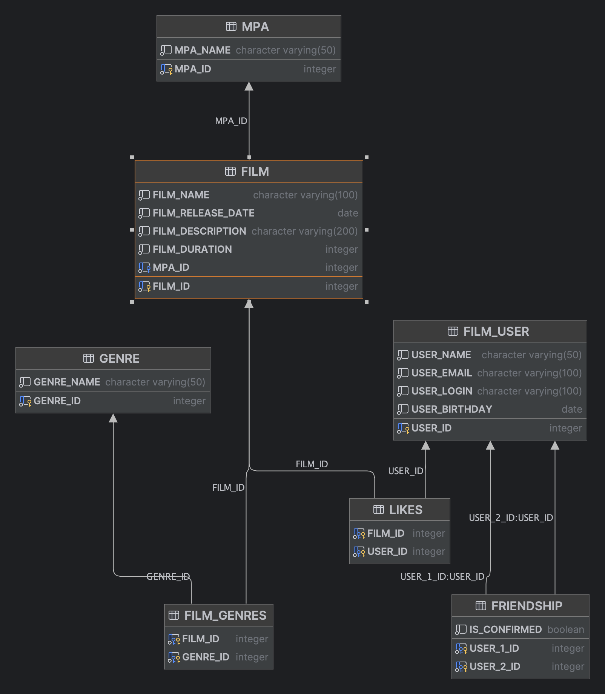

# Filmorate - приложение для оценки и подбора фильмов

---

## Описание

Приложение позволяет получать информацию о фильмах и оценивать их. Также возможно добавлять в друзья других 
пользователей по интересам.

## Функциональность

Приложение предоставляет следующую функциональность:

- Создание, обновление и удаление пользователей сервиса
- Получение информации о конкретном пользователе
- Получение списка всех пользователей
- Добавление, обновление и удаление информации о фильмах
- Получение информации о конкретном фильме
- Получение списка всех фильмов
- Возможность добавлять и удалять фильмам лайки
- Создание, обновление и удаление пользователей сервиса, а также получение их списка.
- Валидация данных, которые приходят в запросе на добавление нового фильма или пользователя.
- Возможность пользователям добавлять друг друга в друзья путем отправки другу заявок и возможностью их подтверждать или отклонять
- Получение списка всех друзей
- Получение списка взаимных друзей


# Это ER-диаграмма для проекта Java-Filmorate


**В схеме отражены следующие сущности:**
1. _FILM_USER_. Хранит данные о пользователях
2. _FILM_. Хранит данных о фильмах
3. _GENRE_. Хранит список жанров
4. _FILM_GENRES_. Хранит соответствие фильмов и жанров между собой
5. _MPA_. Хранит список рейтингов фильма
6. _LIKES_. Хранит лайки пользовталей
7. _FRIENDSHIP_. хранит данные о дружеских связях между пользователями

**Основные операции моего приложения:**

Операции с пользователями:
1. Добавить друга _(addFriend(Long id, Long friendId))_
2. Удалить друга (removeFriend(Long id, Long friendId))
3. Вернуть список общих друзей с одним из пользователей _(findMutualFriends(Long id, Long friendId))_
4. Добавить пользователя _(addUser(User user))_
5. Обновить информацию о пользователе _(updateUser(User user))_
6. Вернуть список всех пользователей _(findUsersList())_
7. Вернуть список всех друзей _(findUserFriendList(Long id))_
8. Найти пользователя по id _(findUserById(Long id))_

Операции с фильмами:
1. Добавить лайк _(addLike(Long id, Long userId))_
2. Удалить лайк (removeLike(Long id, Long userId))
3. Вернуть список самых популярных фильмов _(findPopularFilms(Long count))_
4. Добавить фильм _(addFilm(Film film))_
5. Обновить информацию о информацию о фильме _(updateFilm(Film film))_
6. Вернуть фильм по его id _(findFilmById(Long id))_
7. Вернуть список всех фильмов _(findFilmById(Long id))_

## Технологический стек

Проект использует следующий набор технологий, библиотек и инструментов:

- **[Spring Boot](https://spring.io/projects/spring-boot)**
- **[Spring Framework](https://spring.io/projects/spring-framework)**
- **[Spring Data](https://spring.io/projects/spring-data)**
- **[Lombok](https://projectlombok.org/)**
- **[PostgreSQL](https://www.postgresql.org/)**
- **[IntelliJ IDEA](https://www.jetbrains.com/idea/)**

---

## Установка и запуск

Для того чтобы запустить проект у себя локально, необходимо выполнить следующие шаги:

### Предварительные требования

Убедитесь, что на вашем компьютере установлены следующие инструменты:

- Java JDK 11 или выше: [Скачать](https://www.oracle.com/java/technologies/javase-jdk11-downloads.html)
- Maven 3.9 и выше: [Инструкция по установке](https://maven.apache.org/install.html)
- IntelliJ IDEA (для разработки): [Скачать](https://www.jetbrains.com/idea/download/)

### Установка проекта

1. Клонируйте репозиторий проекта:

```
git clone https://https://github.com/DmitryMisevra/java-explore-with-me.git
cd java-explore-with-me
```

2. Соберите проект с помощью Maven:

```
mvn clean install
```

Чтобы запустить приложение, выполните следующую команду:

```
java -jar target/filmorate-0.0.1-SNAPSHOT.jar
```